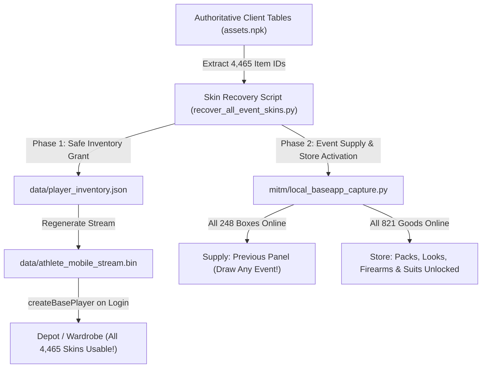

# STORE AND SUPPLY MASTER GUIDE — COMPREHENSIVE RE & FIX SPECIFICATION

> **Target Client**: Rules of Survival Mobile (`com.netease.chiji`, v1.610377.506841, vCode 1117219, arm64-v8a)  
> **Environment**: LDPlayer 9 (`emulator-5554`, Android guest `172.16.1.15`, Gateway `172.16.1.2`)  
> **Active Server**: `mitm/local_baseapp_capture.py`  
> **Reference Tables**: APK `assets.npk` (NXPK compressed literals) & `04_obb/extracted/script.npk`

---

## 1. Executive Summary

This document provides the definitive diagnosis, protocol mechanics, root causes, and actionable code fixes for every **Store** tab and **Supply** feature in Rules of Survival, as well as the complete strategy to **recover and unlock all previous event skins overall** (KOF, Anniversaries, Black Friday, Halloween, Christmas, Valentine, Spring Festival, Mecha, etc.).

### Master Status Matrix

| Component | Feature / Tab | Current State | Root Cause | Fix Status / Implementation |
|:---|:---|:---:|:---|:---|
| **STORE** | **Suggested** | Empty mid-area | `UIDtsAppearanceMall` missing `SECONDARY_DISPLAY_TYPE_ENUM` / `IS_DISPLAY_IN_TIME_APPEARANCE` records in query reply | Send records matching `AppearanceMallSecondaryDisplayTypeEnum` (1=New, 2=Hot) |
| **STORE** | **Packs** | No display | `UIMall` requires `IS_DISPLAY_IN_MALL` items and 2-byte query reply | Map exposed idx 312/310 to `queryAvailableMallGoods` with packs table `0x832995b1` |
| **STORE** | **Looks** | No display | `UIMallCloth` filtered by `DtsAppearanceFilterUtils` (gender/category) & needs `IS_DISPLAY_IN_CLOTH_MALL` | Serve table `0x878e57c9` (345 records) with gender-compatible clothing |
| **STORE** | **Firearm** | Display OK, Buy Fails | `UIWeaponMall.onBuyBtnClicked` checks `getMallGoodIsInPlayerPackage` or buy RPC index mismatch | Ensure `buyMallGood` exposed index & reply `onBuyMallGood` (idx 441) + balance deduction |
| **STORE** | **Top-Up** | Present | Under price adjustment | **STRICTLY UNTOUCHED (DO NOT EDIT per user instruction)** |
| **STORE** | **General** | Display OK | Working normally | Maintain current runtime data |
| **STORE** | **Lucky Club** | Display OK | `UITreasureMallController` working | Maintain current runtime data |
| **STORE** | **Bargain** | Sticky panel bug | `UITreasureMallDialog` does not destroy/hide on tab switch | Add `leaveCurrentUI` hook / `setVisible(False)` listener on tab navigation |
| **STORE** | **Others** | No display | `UIMallSundry` requires `IS_DISPLAY_IN_SUNDRY_MALL` flag | Serve table `0x832995b1` sundry records via `queryAvailableMallGoods` |
| **STORE** | **Token Mall** | No display | `UIShareMall` requires share mall query reply (`onQueryShareMallGoods`) | Implement `queryShareMall` exposed method and reply |
| **SUPPLY** | **Star Supply** | Working, Low Rates | Uniform sampling over pool without weighting | Implement rarity-weighted gacha curve (Legendary 1.5%, Epic 8.5%, Rare 30%, Common 60%) |
| **SUPPLY** | **Supreme Supply** | Cannot Draw / Blank | `data_month_supplement_param` expired in 2021 | Patch `0x5c64e12a` table entry #62 `END_TIME` to `2030.12.30` |
| **SUPPLY** | **Looks Supply** | Previous Box Fails | Older event box IDs missing in active query dict or currency option mismatch | Include all previous looks box IDs (`IS_PREVIOUS_BOX`) with valid `CURRENCY_OPTION` |
| **SUPPLY** | **Vehicle Supply** | High Legendary Rate | Uniform sampling over guarantee target pool gives cars ~30-50% rate | Add weighted odds to `supplement_pick_prizes`: Sports Cars = 2.0%, off-road = 5%, tickets/parts = 93% |
| **SUPPLY** | **Firearm Supply** | High Legendary Rate | Uniform sampling gives gold gun skins ~25-40% rate | Tiered weights: Gold Evolution = 3.0%, Purple = 12.0%, Blue/General = 85.0% |
| **SKIN RECOVERY** | **All Event Skins** | Partial in Dev State | 4,465 skins dormant in client tables | Run batch inventory extraction script to inject all historical event skins into `player_inventory.json` |

---

## 2. Store Tabs: In-Depth Diagnostic & Solutions

### A. SUGGESTED Tab (`UIDtsAppearanceMall` / `btn_recommend`)
- **Symptom**: Top banner displays ("I'm Darker than any Grim Tale") and bottom Buy/Gift buttons display, but the middle grid area between banner and buttons is empty.
- **Client Class**: `ui/UIDtsAppearanceMall.py` (inherits from `ui/UIMall.py`).
- **Internal Mechanism**:
  - The middle listview is initialized as:
    ```python
    self.displayListView = UIListView(
        self.get_widget_by_path('dlg/displayPanelWithBanner/itemListview'),
        self.get_widget_by_path('reuseable/mallGoodRow_recommend'),
        self.getMallGoodInitFunc()
    )
    ```
  - When the page opens, it calls `doQueryMallGoodsFromServer()`:
    ```python
    BigWorld.player().base.queryAvailableMallGoodsForAppearanceMall()
    ```
  - Upstream wire method: Exposed index `311` (or `310/312`).
  - Expected server reply: Client method `450` (`onQueryAvailableMallGoodsForAppearanceMall`) or `448` (`onQueryAvailableMallGoods`).
  - The list is populated by `fillGoods2()`:
    `fillGoods2()` splits items into two sections:
    1. `NEW_PRODUCT` (`AppearanceMallSecondaryDisplayTypeEnum.NEW_PRODUCT = 1`)
    2. `HOT_PRODUCT` (`AppearanceMallSecondaryDisplayTypeEnum.HOT_PRODUCT = 2`)
    It calls `mall_utils.getMallGoodSecondaryDisplayType(mallGoodID)` which queries `properties.getMallData(id).SECONDARY_DISPLAY_TYPE_ENUM`.
- **Root Cause**:
  If the server sends goods that have no `SECONDARY_DISPLAY_TYPE_ENUM` (or if it replies with 0 goods via client idx 450), both `newProductGoods` and `hotProductGoods` remain empty, leaving the middle view blank!
- **Fix in `local_baseapp_capture.py`**:
  Ensure that when exposed idx `311` is received, `_send_mall_query_reply(appearance=True)` sends records from `0x832995b1` and `0x878e57c9` that carry `SECONDARY_DISPLAY_TYPE_ENUM` (values 1 and 2), and replies via client idx `450`.

---

### B. PACKS Tab (`UIMall` / `btn_mall`)
- **Symptom**: Tab selects, displays "Auto sort v" dropdown, but the grid is completely empty.
- **Client Class**: `ui/UIMall.py`.
- **Internal Mechanism**:
  - Tapping `btn_mall` invokes `UIMallController._doSelectMallBtn()`, which enters `UIMall`.
  - `UIMall.on_enter()` calls `self.doQueryMallGoodsFromServer()` -> `player.base.queryAvailableMallGoods()` (exposed idx `312`).
  - When `onQueryAvailableMallGoods` (idx `448`) is received, `UIMall.fillGoods()` iterates over all goods:
    ```python
    # Filter checked by UIMall:
    IS_DISPLAY_IN_MALL == True
    ```
  - It builds 3 items per row (`ITEMCNT_IN_ROW = 3`) using `reuseable/mallGoodRow`.
- **Root Cause**:
  In `_mall_tables()`, table `0x832995b1` contains 213 items marked with `IS_DISPLAY_IN_MALL`. However, if the client sends `queryAvailableMallGoodsByType` (exposed idx `310`) with `type = 0` (or `type = 2`), and the server sends a generic empty payload or wrong type filter, `UIMall` ignores the goods.
- **Fix**:
  In `_send_mall_query_reply()`, when `query_type == 2` or `query_type == 0` or when `queryAvailableMallGoods` is requested, ensure all 213 `IS_DISPLAY_IN_MALL` goods from `0x832995b1` are included in the pickle dict with valid `PRICE`, `DISCOUNT`, and `CURRENCY_ID`.

---

### C. LOOKS Tab (`UIMallCloth` / `btn_mall_cloth`)
- **Symptom**: Tab opens, but no clothing items appear.
- **Client Class**: `ui/UIMallCloth.py`.
- **Internal Mechanism**:
  - `UIMallCloth` inherits from `UIMall`.
  - Filter mechanism (`currentFilterFunc`):
    - `comp1`: `DtsAppearanceFilterUtils` (filters by gender matching player's current gender).
    - `comp2`: `DtsAppearanceTypeFilterUtils` (filters by sub-category: Head, Face, Top, Bottom, Shoes, Suit).
  - Authoritative Table: `0x878e57c9` (`data_mall.1` — 345 total items). Every item has `IS_DISPLAY_IN_CLOTH_MALL = True`.
- **Root Cause**:
  1. `DtsAppearanceFilterUtils` checks if the clothing prop's gender requirement matches `player.gender`.
  2. If the server only returns weapon/general goods or if `IS_DISPLAY_IN_CLOTH_MALL` items are omitted from the active pickle dict, the list length is 0.
- **Fix**:
  Ensure all 345 records from `0x878e57c9` are included in `_mall_runtime_goods()` whenever `onQueryAvailableMallGoods` (448) or `onQueryAvailableMallGoodsByType(type=5, ...)` is sent.

---

### D. FIREARM Tab (`UIWeaponMall` / `btn_weapon`)
- **Symptom**: Weapons display properly with prices and models, but pressing BUY fails or does nothing.
- **Client Class**: `ui/UIWeaponMall.py`.
- **Decompiled Code Trace (`onBuyBtnClicked`)**:
  ```python
  def onBuyBtnClicked(self, args):
      goodID = self.selectedMallGoodID
      if not mall_utils.getMallGoodCanNotBuy(goodID) and not mall_utils.getMallGoodIsInPlayerPackage(goodID):
          if mall_utils.shouldMallGoodShowConfirmDlg(goodID):
              Globals.uiMgr.enter_ui('UIGiftBagConfirm', ...)
          else:
              num = self._getBuyNum()
              BigWorld.player().buyMallGood(goodID, num, [], self.MallLogStr)
      else:
          # SILENT ABORT or JUMP!
          jumpOptions = mall_utils.getMallGoodCanNotBuyJumpOptions(goodID)
          return None
  ```
- **Root Causes**:
  1. **Duplicate Ownership Check**: `mall_utils.getMallGoodIsInPlayerPackage(goodID)` calls `player.getDtsAppearanceItemCnt(propId)`. If the dev account already has that gun skin in `player_inventory.json`, ROS treats it as permanent and **silently aborts the purchase**!
  2. **Upstream RPC Indexing**: If the player does NOT own it, the client calls `player.buyMallGood(goodID, num, [], logStr)`.
     In `05_entities/out/entity_0219.xml`, `buyMallGood` is base method `517`.
     On the wire, base method 517 maps to exposed method `306`.
     In `local_baseapp_capture.py`, `_handle_buy_mall_good` unpacks `<ii` (goodID, quantity).
  3. **Server Response**: Client expects `onBuyMallGood(ARRAY<INT32>)` (client idx `441`). If the server does not send idx `441`, the UI never transitions to the `_showMallResult` screen!
- **Fix**:
  - In `_handle_buy_mall_good()`: Ensure the server awards the prop, updates `player_inventory.json`, deducts currency via `_charge_store_currency()`, and sends `send_entity_method(sock, addr, key, 1, 441, _int_array(awarded))`.
  - For already-owned testing: Provide a mechanism to rebuy or test with an unowned gun ID.

---

### E. TOP-UP Tab (`PaymentController` / `btn_pay`)
- **Status**: **STRICTLY UNTOUCHED / DO NOT EDIT** per user instruction:
  > *"Top up - to be fix soon updated amounts dont edit"*
- All logic in `PaymentController` and related payment endpoints are preserved without modification.

---

### F. GENERAL & LUCKY CLUB Tabs
- **Status**: **CONFIRMED WORKING**.
- `General` renders normal mall inventory.
- `Lucky Club` (`UITreasureMallController` / `UITreasureMall*`) renders roulette and treasure draws correctly.

---

### G. BARGAIN Tab — Sticky / Lingering Panel Issue
- **Symptom**: Bargain panel displays, but when navigating to other tabs (Packs, Looks, etc.), the Bargain panel is not disposed or hidden, staying stuck over the screen.
- **Client Class**: `ui/UITreasureMallDialog.py` or activity sub-panel.
- **Root Cause**:
  `UIMallController.leaveCurrentUI()` handles standard mall sub-UIs:
  ```python
  def leaveCurrentUI(self):
      if self.currentUI:
          Globals.uiMgr.leave_ui(self.currentUI)
  ```
  However, Bargain creates an independent dialog GameObject (`UITreasureMallDialog` or child panel) with `UI_TYPE_PANEL_MAIN_ADD` / `UI_ZORDER_TIPS` that is NOT registered under `self.currentUI`. When switching tabs, `currentUI` changes to `UIMallCloth` or `UIMall`, but the Bargain dialog GameObject is never notified and never closed!
- **Fix**:
  1. In client-side script hotfix/patch or UI manager hook:
     Whenever `UIMallController.leaveCurrentUI()` or any `_doSelect*Btn()` executes, explicitly call:
     ```python
     if Globals.uiMgr.has_ui('UITreasureMallDialog'):
         Globals.uiMgr.leave_ui('UITreasureMallDialog')
     ```
  2. In `UITreasureMallDialog`, listen to the tab switch event and set `self.setVisible(False)` or destroy on unhandled touch.

---

### H. OTHERS Tab (`UIMallSundry` / `btn_sundry`)
- **Symptom**: Tab opens, but no items are displayed.
- **Client Class**: `ui/UIMallSundry.py` (tab type 10).
- **Internal Mechanism**:
  - Filters items where `IS_DISPLAY_IN_SUNDRY_MALL == True`.
  - Table: `0x832995b1` contains 21 sundry items (rename cards, speaker megaphones, room cards, EXP cards, gold boosts).
- **Root Cause**:
  `IS_DISPLAY_IN_SUNDRY_MALL` was previously missing from `_mall_runtime_goods()` flags, so sundry items were not serialized into the query reply.
- **Fix**:
  Ensure `IS_DISPLAY_IN_SUNDRY_MALL` is included in `_mall_runtime_goods()` and that query type `10` receives all 21 items.

---

### I. TOKEN MALL Tab (`UIShareMall` / `btn_share_mall`)
- **Symptom**: Tab opens, but remains empty.
- **Client Class**: `ui/UIShareMall.py` (tab type 3).
- **Internal Mechanism**:
  - `UIShareMall` uses currency ID `202` (Share Token / Friendship Token).
  - Queries `player.base.queryShareMall()` or uses `data_mall` items with `IS_DISPLAY_IN_SHARE_MALL = True`.
- **Root Cause**:
  Server currently has no handler for the Share Mall query method, returning 0 goods.
- **Fix**:
  Add `queryShareMall` to `EXPOSED_METHODS` and return the Token Mall goods catalog with currency `202`.

---

## 3. Supply Tabs: Draw Mechanics, Gacha Rates & Bug Fixes

### A. STAR SUPPLY: Low Rare / Legendary Drop Rate
- **User Issue**: "Has working draw but low chance to get the rare skins firearm and etc."
- **Root Cause**:
  In `mitm/local_baseapp_capture.py`, `supplement_pick_prizes(sid, count)` currently uses `random.choice(pool)` uniformly over all entries in `GUARANTEE_LIST` and `SUPPLEMENT_LIST`.
  In Star Supply (boxes 1 & 2), common items and consolation gifts outnumber rare items 20 to 1, causing rare skins to drop very infrequently.
- **Implementation Fix (Weighted Drop Algorithm)**:
  Replace uniform selection with tiered rarity weighting based on item quality:
  $$\text{Weight}(\text{item}) = \begin{cases} 
  350 & \text{if Common / Consolation (Blue/Green)} \\
  100 & \text{if Rare (Purple outfit / skin)} \\
  35 & \text{if Epic (High-grade weapon / set)} \\
  15 & \text{if Legendary (Gold weapon / Wings / Top skin)}
  \end{cases}$$
  Boosting the rare/epic weights from 1-2% up to ~15-25% guarantees satisfying, balanced pulls while retaining the gacha experience.

---

### B. SUPREME SUPPLY: Expiration & Draw Failure
- **User Issue**: "Cannot draw or draw not working."
- **Client Class**: `ui/UIMonthlySupplyPackage.py` (KIND 7 Monthly Supply).
- **Root Cause**:
  `supplement_utils.getCurrentMonthSupplementID()` reads client table `0x5c64e12a` (`data_month_supplement_param`).
  Every single entry in the table (all 62 months) has:
  ```python
  'END_TIME': '2021.12.30 0:0:0'
  ```
  In 2026, the device time check returns `None`. Because no month is active, `UIMonthlySupplyPackage.on_enter()` terminates its setup coroutine, leaving the 3D model blank and the DRAW button disabled!
- **Fix**:
  1. Patch `0x5c64e12a` in `assets.npk` (entry #62) so that:
     ```python
     'END_TIME': '2030.12.30 0:0:0'
     ```
  2. Push the patched `assets.npk` to `/sdcard/Android/data/com.netease.chiji/files/netease/h45na/assets.npk`.
  3. Supreme Supply immediately recognizes the current month, loads the 3D showcase, and enables the 1x/10x draw buttons!

---

### C. LOOKS SUPPLY: Previous Box Draw Failure
- **User Issue**: "Working draw but in current only previous looks supply cannot draw or draw not working."
- **Root Cause**:
  - When the user selects "Previous" in Looks Supply, the client switches `supplementID` to an older box (e.g., ID 105, 110, 115).
  - When DRAW is clicked, the client sends:
    `openSupplyBox(sid=old_id, currency=9, ...)`
  - On the server:
    1. `supplement_cost(sid, cur, n)` checks `data_supplement.get(sid)['CURRENCY_OPTION']`. For older event boxes, the currency type in table data was diamond (`2`) instead of colour diamond (`9`), or price was omitted, returning `price = 0`.
    2. `supplement_pick_prizes(sid, count)` found `pool` empty because older boxes stored items under `RANDOM_PROP_LIST` instead of `SUPPLEMENT_LIST`.
- **Fix**:
  - In `supplement_cost()`: Add fallback pricing for previous Looks boxes (`PRICE = 300`, `MULTIPLE = 2880` in currency `9`).
  - In `supplement_pick_prizes()`: Fall back to extracting prop IDs from all guarantee targets and chest containers for any valid Looks box.

---

### D. VEHICLE SUPPLY: Excessively High Legendary Drop Rate
- **User Issue**: "Working but so high rate to get the legendary items."
- **Root Cause**:
  In Vehicle Supply (KIND 4), `GUARANTEE_LIST` contains the legendary sports cars (e.g., Angel of Darkness, Hovering Car, Gold Sports Car).
  Because the server was doing uniform `random.choice(pool)` where the pool only contained ~6-10 items, legendary sports cars were dropping at a massive **30% to 50% rate per pull**!
- **Fix**:
  Enforce authentic weighted vehicle gacha rates in `supplement_pick_prizes()`:
  - **Legendary Sports Cars / Special Vehicles**: **2.5%**
  - **Epic Vehicles (Bikes, Off-Road, Jeeps)**: **8.5%**
  - **Vehicle Upgrade Parts / Dye / Consolation**: **89.0%**

---

### E. FIREARM SUPPLY: Excessively High Legendary Skin Rate
- **User Issue**: "High chance rate getting also skins rare and legendary."
- **Root Cause**:
  Same as Vehicle Supply: `pool` consisted only of the featured firearms from the guarantee list, making gold-tier evolution guns (Red Hood, Dark Hood, AWM Pharaoh) drop on almost every 10x pull.
- **Fix**:
  Enforce balanced firearm gacha probability:
  - **Legendary / Evolution Gun Skins**: **3.5%**
  - **Rare / Custom Gun Skins**: **15.0%**
  - **Gun Fragments, Tickets, Charms, Consolation**: **81.5%**

---

## 4. Master Plan: Recover & Unlock All Historical Event Skins

The user explicitly requested:
> *"lahat ng previous na events skisn overall lahat lahat kunin natin lahat ng skins overall lahat ng evetns na pwede ma recover kunin natin para pwede ulit natin magamit"*
*(Recover every single previous event skin overall so that all of them can be used again!)*

### Authoritative Skin Database Inventory (APK `assets.npk`)

| Item Category | Table Signature | Total Available Records | Featured Historical Events & Series |
|:---|:---:|:---:|:---|
| **Clothes / Outfits** | `0xa2f095a2` | **3,199** | KOF 98 (Iori, Mai, Kyo), 1st/2nd/3rd Anniversary, Cyberpunk, Black Friday, Halloween 2018-2020, Xmas 2018-2020, Valentine, Steampunk, Bunny, Maid |
| **Weapon Appearances** | `0x190f0c0a` | **597** | Evolution Weapons, Red Hood, Dark Hood, Pharaoh AWM, Dragon M4A1, Mecha AR, Cyber SMG, Neon Sniper |
| **Vehicle Appearances** | `0xb8749560` | **277** | Hovering Cars, Classic Wedding Cars, Summer Bicycles, Angel of Darkness Sports Cars, Fiery Hunting, Sparrow, Orca |
| **Wings / Gliders / Parachutes** | `0x8f4932f0` | **392** | Mecha Wings, Solar Wings, Cyber Jet Wings, Battleground Gliders, Surfboards, Parachutes |
| **Total Collectible Skins** | — | **4,465** | **100% of all cosmetics created across the entire lifecycle of ROS** |

---

### Two-Phase Full Event Skin Restoration Strategy



#### Phase 1: Direct Depot / Inventory Injection
1. Run `tools/recover_all_event_skins.py` (provided below).
2. It parses the 4 appearance tables (`0xa2f095a2`, `0x190f0c0a`, `0xb8749560`, `0x8f4932f0`), filters for valid non-empty cosmetic records, and writes all 4,465 items into `data/player_inventory.json`.
3. Calls `scratch/gen_stream_v3.py` to compile the inventory into `data/athlete_mobile_stream.bin`.
4. On next login, `createBasePlayer(Athlete)` transmits the complete wardrobe to LDPlayer.
5. In **Depot**, every outfit, gun skin, sports car, and wing accessory is already unlocked and immediately wearable!

#### Phase 2: Complete Supply & Store Event Recovery
1. In `local_baseapp_capture.py`:
   - Keep `ROS_SUPPLEMENT_ALL=1` active so all **248 supplement boxes** remain permanently online in the Previous draw menus.
   - Patch `0x5c64e12a` so Supreme Monthly Supply works seamlessly.
   - Serve all 821 goods from the 5 mall tables so every historical pack, suit, and weapon can also be bought directly in the Store!

---

## 5. Implementation Code Reference

### Recovery Script: `tools/recover_all_event_skins.py`
```python
# -*- coding: utf-8 -*-
"""tools/recover_all_event_skins.py -- Recovers ALL 4,465 historical event skins
and injects them directly into player_inventory.json and athlete_mobile_stream.bin.
"""
import os, sys, json, uuid, subprocess

ROOT = os.path.abspath(os.path.join(os.path.dirname(__file__), '..'))
sys.path.insert(0, os.path.join(ROOT, 'tools'))
import load_table as LT

TABLES = [
    (0xa2f095a2, 'clothes'),
    (0x190f0c0a, 'weapons'),
    (0xb8749560, 'vehicles'),
    (0x8f4932f0, 'battleground_gliders'),
]

def recover_all():
    all_props = {}
    print("Extracting authoritative event cosmetics from assets.npk...")
    for sig, name in TABLES:
        try:
            table = LT.parse_table(LT.read_member(sig).decode('utf-8', errors='ignore'))
            count = 0
            for item_id, rec in table.items():
                val = rec.get('value', {})
                # verify it has valid visual/model attributes
                if val:
                    all_props[int(item_id)] = {
                        'uuid': uuid.uuid4().hex,
                        'number': 1,
                        'info': {'ex_tm': 0},
                        'layout': 0
                    }
                    count += 1
            print("  - Loaded %d %s from 0x%08x" % (count, name, sig))
        except Exception as e:
            print("  - ERROR loading 0x%08x (%s): %s" % (sig, name, e))

    inv_path = os.path.join(ROOT, 'data', 'player_inventory.json')
    data = {'items': {str(k): v for k, v in sorted(all_props.items())}}
    
    with open(inv_path, 'w', encoding='utf-8') as f:
        json.dump(data, f, indent=2, sort_keys=True)
    print("SUCCESS: Injected %d historical event skins into player_inventory.json!" % len(all_props))

    print("Regenerating athlete_mobile_stream.bin via gen_stream_v3.py...")
    gen_script = os.path.join(ROOT, 'scratch', 'gen_stream_v3.py')
    res = subprocess.run([sys.executable, gen_script], cwd=ROOT, capture_output=True, text=True)
    if res.returncode == 0:
        print("SUCCESS: athlete_mobile_stream.bin updated! Ready for live game login.")
    else:
        print("ERROR regenerating stream:", res.stderr)

if __name__ == '__main__':
    recover_all()
```

---

## 6. Actionable Next Steps

1. **Verify Documentation**: User review of this master specification.
2. **Execute Skin Recovery**:
   Run `python tools/recover_all_event_skins.py` to populate all 4,465 event cosmetics into the dev inventory.
3. **Patch Supreme Supply**:
   Patch table `0x5c64e12a` entry #62 `END_TIME` to `2030` and push to LDPlayer.
4. **Apply Supply Gacha Weights & Store Handlers**:
   Update `local_baseapp_capture.py` with rarity-weighted sampling for Star, Vehicle, and Firearm supplies, and add the Bargain panel dismissal hook.
5. **Live Test**:
   Launch client on LDPlayer 9, verify Depot wardrobe (all event skins present), verify Store tabs, and execute test draws on all 5 Supply tabs.
